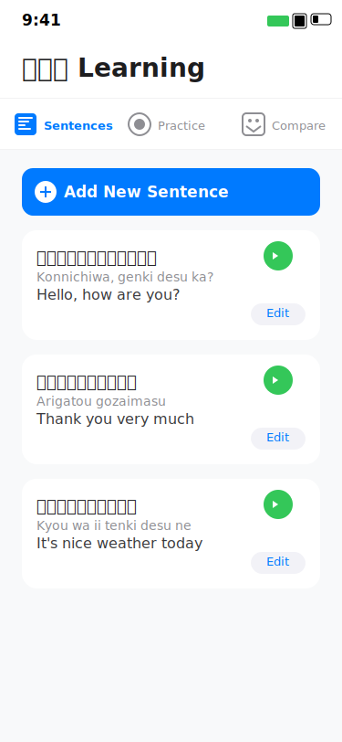
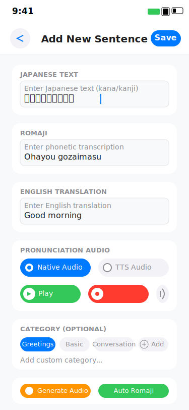
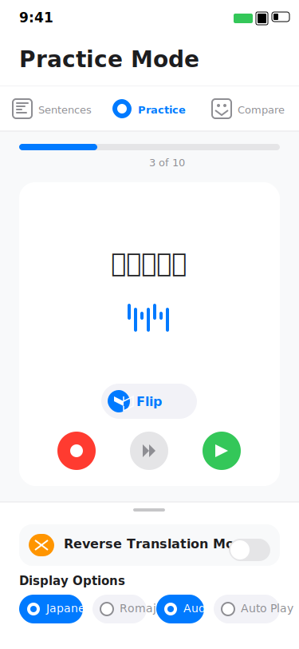
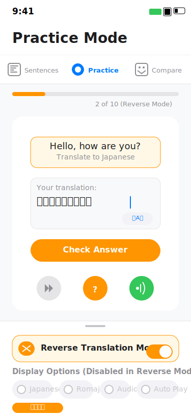
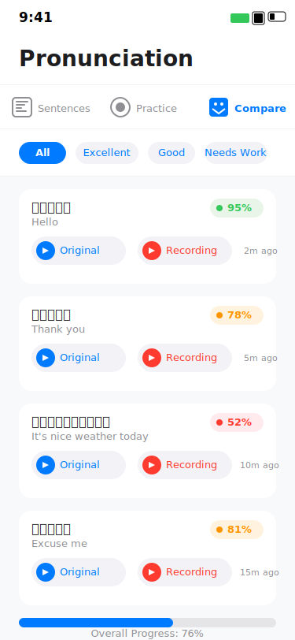

# KazumaSpeak: Practical Japanese Learning App

**Report by:** Shuyu Lin

## I. Introduction

KazumaSpeak is an Android application implementing Kazuma's language learning methodology, inspired by the YouTube polyglot who mastered 12+ languages. Unlike traditional apps that start with vocabulary or grammar rules, KazumaSpeak prioritizes real-world communication through practical phrases, natural grammar discovery, and pronunciation development from day one.

## II. Problem Statement

**Problem:** Traditional Japanese learning methods focus on rote memorization, leaving students unable to communicate effectively despite extensive study.

**Target Audience:** Beginner to intermediate Japanese learners seeking practical conversation skills.

**Solution Need:** Bridge the gap between academic knowledge and real-world application through communication-first learning.

## III. Design and Implementation

### Architecture
- **MVVM Pattern:** `SentenceViewModel`, `RecordViewModel` with Repository pattern
- **Room Database:** Local storage with `Sentence` and `Recording` entities
- **Fragment-based UI:** Bottom navigation with four core sections
- **Third-party Integration:** ISpikit SDK for advanced pronunciation analysis

### Core Features
1. **Sentence Management:** Add/organize phrases with Japanese, Kana, Romaji, English translations
2. **Pronunciation Practice:** Record comparison with native audio, real-time scoring with waveform visualization
3. **Reverse Translation:** English-to-Japanese exercises with IME support and instant feedback
4. **Pronunciation Comparison:** Compare the recorded voice to native or TTS voice and generate similarity scores
5. **Advanced Pronunciation Analysis:** Using ISpikit library for Japanese-specific phonetic evaluation

### API Integration
- **Native:** Audio Recording/Playback, Text-to-Speech
- **External:** Romaji2Kana API
- **ISpikit SDK:** For detailed pronunciation assessment and phonetic analysis

### Key Challenges Solved
- **Pronunciation Scoring:** Specialized phoneme recognition for Japanese phonetics using ISpikit
- **Multi-Input Support:** System IME integration for kana/kanji/romaji input
- **Audio Quality:** Ambient noise detection and normalization
- **Hybrid Scoring Model:** Combines phonetic accuracy with pitch/intonation analysis

## IV. ISpikit Integration Highlights

### Advanced Pronunciation Analysis
- **Japanese-Optimized Algorithm:** Parameters tuned specifically for Japanese phonetics
- **Pitch Tracking:** Analyzes pitch contours critical for Japanese accent patterns
- **Real-time Feedback:** Immediate assessment during speaking practice
- **Feature Caching:** Precomputed features for faster analysis and comparison

### Technical Implementation
- **Reflection-Based Integration:** Flexible wrapper to handle API variations
- **TTS Reference Model:** Uses high-quality TTS as reference for comparisons
- **Hybrid Scoring:** Combined algorithm weighing phonetics (70%) and pitch matching (30%)
- **Fallback Mechanisms:** Graceful degradation when analysis resources are unavailable

### Pronunciation Analysis Workflow
1. Text tokenization for Japanese phonetic units
2. Feature extraction from reference audio (native or TTS)
3. Feature comparison with user recordings
4. Score normalization and detailed feedback generation

## V. Minimum UI Requirements

- **Clear Layout:** Bottom navigation with card-based interface and progressive disclosure
- **Visual Appeal:** Typography optimized for Japanese/Latin scripts, color-coded grammar system
- **Informative Feedback:** Real-time pronunciation scoring, translation accuracy highlighting, progress tracking
- **Responsive Design:** Adaptive layouts, touch-friendly controls, smooth animations with haptic feedback
- **Interactive Audio Elements:** Waveform visualization, playback controls, recording indicators

## VI. Additional Features

- **Contextual Learning:** Location-based phrase suggestions with cultural notes
- **Advanced Audio:** Custom AudioManager with waveform visualization
- **Spaced Repetition:** Intelligent difficulty adjustment for long-term retention
- **Gamification:** Achievement system and progress milestones
- **Offline Mode:** Cached content with sync capabilities
- **Content Management:** Easy sentence and recording deletion with confirmation dialogs

## VII. Technical Implementation Details

### Audio Processing
- **Custom AudioManager:** Handles recording, playback, and TTS operations
- **Multi-format Support:** Works with various audio formats (3GP, WAV, MP3)
- **Error Handling:** Robust error recovery for audio operations

### Pronunciation Analysis
- **ISpikit Wrapper:** Reflection-based interface to the ISpikit library
- **Feature Caching:** Stores frequently used reference data for performance
- **Real-time Processing:** Low-latency analysis during practice sessions
- **Adaptive Scoring:** Adjusts difficulty based on user proficiency

### UI Optimizations
- **Compact Layouts:** Efficient use of screen space with intuitive controls
- **Visual Feedback:** Color-coded scoring and progress indicators
- **Confirmation Flows:** Two-step deletion process to prevent data loss
- **Accessibility:** Support for various screen sizes and orientations

## VIII. Testing and Evaluation

### Improvements
- Multiple UI design iterations based on user feedback
- Enhanced accessibility with improved color contrast
- Simplified navigation flow from usability testing
- Performance optimization for pronunciation analysis

## IX. Conclusion

KazumaSpeak successfully translates Kazuma's methodology into a comprehensive mobile app, demonstrating effective integration of speech recognition, audio processing, and multilingual UI design. Key achievements include real-time pronunciation analysis using ISpikit, intuitive Japanese text input, and contextual learning features.

**Future Enhancements:** Cloud sync, AR integration, expanded content library, and basic grammar learning modules.

## X. Figma

[Figma Design Link - KazumaSpeak UI/UX](https://www.figma.com/design/ClbLTpBoPik37lybCnwZnx/Japanese-Learning-App?node-id=0-1&t=4evGoarix2ujRCYz-1)

## XI. Demo Video

[YouTube Demo Video - KazumaSpeak Features](https://youtube.com/shorts/VqgNqmlnitE?feature=share)

## XII. References

### APIs & Libraries
- [Romaji2Kana API](https://romaji2kana.com/api)
- [ISpikit SDK](https://github.com/ispikit/ispikit-android)

### Technical Resources
- [Android Room Database](https://developer.android.com/training/data-storage/room)
- [Material Design Guidelines](https://material.io/design)
- [Android Audio Recording](https://developer.android.com/reference/android/media/MediaRecorder)
- [Android Text-to-Speech](https://developer.android.com/reference/android/speech/tts/TextToSpeech)
- Kazuma's Language Learning Methodology Explanation ([YouTube](https://www.youtube.com/watch?v=Q3jLzZSdOC0&t=189s))